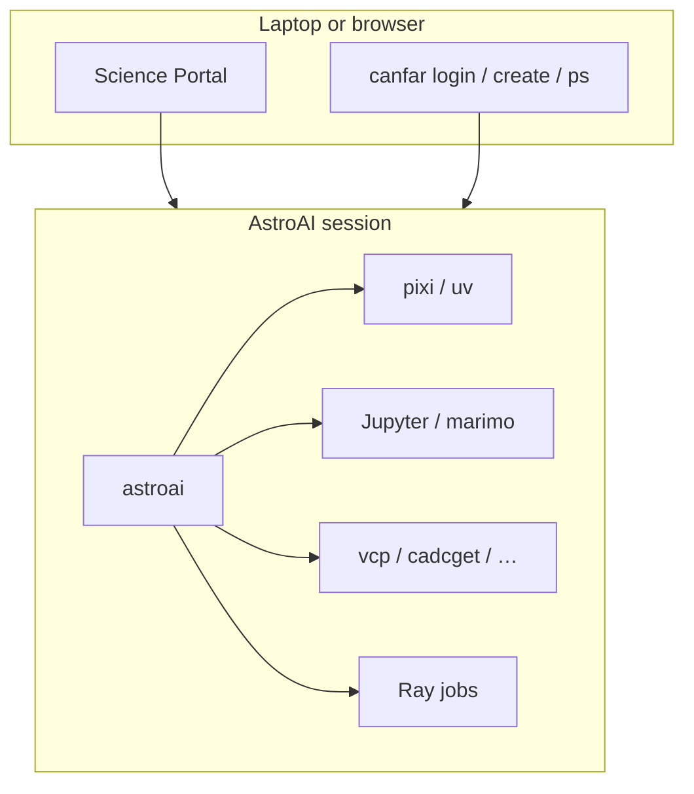

# astroai usage

**`astroai`** is the in-session CLI on AstroAI images
([CANFAR Science Platform](https://www.opencadc.org/canfar/)).

It does project environments (`init` / `save` / `resume`), the Ray cluster
(`cluster start` / `run`), agents, kernels, and session status.

| Tool | Role |
|------|------|
| [`canfar`](https://github.com/opencadc/canfar) | Auth, session lifecycle, `canfar data` |
| CADC clients (`cadcget`, `vcp`, …) | Archive and VOSpace I/O |
| [Session images](https://github.com/astroai/canfar-containers) | `webterm`, `notebook`, `vscode`, `marimo`, Ray |

| Doc | Scope |
|-----|--------|
| **USAGE.md** (this file) | Where to work, storage, Ray, agents |
| [help.md](help.md) | Cheat sheet |
| [cli.md](cli.md) | Flags and every command |
| [config.md](config.md) | Optional `~/.astroai/lab/config.yaml` |

In a session: `astroai help` · `less /opt/astroai/USAGE.md` (image user guide).

Platform: [opencadc.github.io/canfar](https://opencadc.github.io/canfar/)

---

## Where you work



| Where | What you do | Tools |
|-------|-------------|--------|
| **Laptop / browser** | Log in, start and stop sessions | Science Portal, or `canfar login` / `create` / `ps` |
| **Inside a session** | Code, notebooks, training, agents | `astroai`, Jupyter, pixi/uv, CADC clients |

### Notebook-first

1. [Science Portal](https://www.canfar.net/science-portal) → **notebook** or **marimo**.
2. Jupyter: `/opt/astroai/notebooks/starter.ipynb` (kernel: `astroai kernel ensure`).
3. Marimo: `$WORK/notebooks/starter.py`.
4. `astroai status` for paths and quotas.
5. Keep results with `canfar data` or `vcp`. There is no `astroai` VOSpace wrapper.

---

## Install

Images ship `astroai` on PATH (`/opt/astroai/venv/cadc`).

```bash
uv tool install git+https://github.com/astroai/canfar-lab.git
uv sync --all-extras && uv run astroai --help
./scripts/ci.sh
```

---

## Code propagation (sessions + jobs)

On CANFAR, **local code always lives under `$WORK`**, which defaults to
**`$SCRATCH/src`** (same as `$SRCDIR`). That tree survives container OOM
restarts but **dies with the session**. Never put project code in
`/arc/home` or `$HOME/.local`.

Workers and new pods **do not** see another pod's `/scratch`. Pick an
explicit propagation mode before `astroai run` / headless jobs:

| Mode | What moves | When to use | How |
|------|------------|-------------|-----|
| **1. GitHub push → pull** | Source only (deps via pixi/uv on install) | Default for WIP on your fork | Push to `origin` (sfabbro fork). On the job/session: `astroai clone <fork/repo> --update` (ff-only to latest origin tip) or `--ref <branch\|sha>` to pin. Print SHA is the receipt. |
| **2. `astroai save` / `resume`** | **Lockfiles (+ optional `.pixi`/`.venv` with `--full`)** — **not** your `.py` tree | Warm envs across sessions | `astroai save mylab [--full]`; next session `astroai resume mylab` then still need mode 1 (or shared `/arc`) for source. |
| **3. VOSpace tarball** | Source **and** usually need deps inside or a matching save | Share a frozen tree without git, or headless cold start | Pack under `vos:$USER/astroai/<name>.tar.zst` (or `arc:`), unpack into `$WORK` on the worker. You own the layout; CLI does not auto-pack yet. |
| **4. Save + VOSpace (2+3)** | Env snapshot + code tarball | Reproducible headless: same env + same source blob | `astroai save mylab --full` to home/project; upload code tarball to `vos:$USER/astroai/`; job restores both into `$WORK`. |

**Same-session Ray jobs:** `astroai run train.py` packages the script's
directory as Ray `working_dir` (local tree). Still push/save before the
session ends if you need the work later.

**Secure "latest fork" (mode 1):** always `git push origin` from the
interactive session, then on the consumer `astroai clone … --update`
(refuses dirty trees unless `--force`). Prefer `--ref <sha>` for pinned
science runs.

```bash
# Interactive session
cd "$WORK/torchsky"          # → /scratch/src/torchsky on CANFAR
git push -u origin HEAD
astroai save torchsky        # env only

# New session / headless prelude
astroai clone sfabbro/torchsky --update          # latest origin tip + SHA printed
# or: astroai clone sfabbro/torchsky --ref abc1234
pixi run python train.py
```

## First project

```bash
astroai init mylab
cd "$WORK/mylab"
pixi add numpy
pixi run python -c "import numpy; print(numpy.__version__)"
astroai save mylab
```

Clone (needs `gh auth login` once):

```bash
astroai clone owner/repo
astroai clone owner/a owner/b
astroai clone --from-env mylab owner/repo
astroai clone owner/repo --update              # refresh existing checkout
astroai clone owner/repo --ref wip/topic
astroai clone owner/repo --dir ~/src           # persist on /arc/home
astroai clone owner/repo --dir /arc/projects/mygroup
```

`save` writes lockfiles to `~/.astroai/lab/saves/` on `/arc/home`. The next
session `resume`s that snapshot — **not** your source tree (see Code
propagation above).

---

## Storage

| Tier | Env / path | Lifetime | Use for |
|------|------------|----------|---------|
| Source | `SRCDIR` (`$SCRATCH/src` on CANFAR; `WORK` is the same path) | Session (survives container OOM) | Code, pixi/uv projects |
| Scratch | `SCRATCH` (`/scratch`) | Session | Datasets, caches |
| Home | `/arc/home/<you>` | Persistent | Config, saves, certs |
| Projects | `/arc/projects/<group>` | Persistent | Shared data and team saves |

```bash
astroai status
astroai status --all
astroai clean --yes          # ~/.cache on home (not scratch caches)
canfar data …
vcp ./local.fits vos:…
```

---

## Ray cluster and jobs

Usual path: one autoscaling manager, then a job with `--cpus`. Same as
AstroAI hub **Start batch compute**.

```bash
astroai cluster start                # autoscaling head; Ray adds workers on demand
astroai run train.py --cpus 2        # discovers the manager; --cpus spins a worker
astroai cluster status
```

Optional: `export ASTROAI_RAY_JOBS_ADDRESS=…` overrides discovery (printed by
`cluster start`; unnecessary in other sessions when a manager is Running).
Inside the manager session the default is localhost.
Size the ceiling with `--min-workers` / `--max-workers` / `--cores` / `--ram`
/ `--gpus`. `astroai status` is this session's quota, not the cluster.

```bash
astroai cluster stop                 # destroys workers AND the manager
astroai cluster dashboard            # Ray Dashboard URL
astroai jobs list
```

Do not use `ray job submit`. The job command is `astroai run`.
Manager memory **≥8 GiB**. Shared data on `/arc`; `/scratch` is per-pod.
More: [containers RAY.md](https://github.com/astroai/canfar-containers/blob/main/docs/RAY.md).

---

## Working with `canfar`

```bash
canfar login
canfar create --name demo webterm
canfar ps
canfar open <session-id>
canfar delete <session-id>
cadcget …
vls vos:…
```

`astroai status` includes `canfar auth show` and `canfar ps` when `canfar` is on PATH.

---

## Command map

| Goal | Command |
|------|---------|
| Banner | `astroai` |
| New project | `astroai init NAME` |
| Clone + install | `astroai clone REPO` |
| Snapshot env | `astroai save [NAME]` |
| Restore env | `astroai resume NAME` |
| This session’s quota | `astroai status` |
| Free home space | `astroai clean` |
| Start Ray cluster | `astroai cluster start` |
| Is the cluster up? | `astroai cluster status` |
| Run a job | `astroai run SCRIPT --cpus N` |
| Jupyter kernel | `astroai kernel ensure` |
| Agents | `astroai agent setup` / `install` / `verify` |

Flags: [cli.md](cli.md).

Two sessions share `/arc/home` — what is safe to run concurrently and where
agent runtimes live: [concurrency.md](concurrency.md).

---

## Shell completion

```bash
astroai --install-completion bash   # or zsh, fish
astroai help -c "agent l"<TAB>
astroai agent install <TAB>
```

---

## AI coding agents

Configs and CLI binaries stay on `/arc` home (`~/.local/bin` and agent dirs).
You can install/update agents with upstream installers without AstroAI.
Skills: ``npx skills add …`` (skills.sh) — not managed by AstroAI.
Caches and agent runtime DBs still use `$SCRATCH`.

```bash
astroai agent list
astroai agent install kilo
# or: curl -fsSL … | bash   # same home land site as upstream
astroai agent setup hermes
astroai agent setup --all
npx skills add astroai/canfar-skills
astroai agent plugins install ray-manager-mcp
astroai agent update
astroai agent verify --fix
```

Skill packs (SKILL.md) install via **`npx skills`**, not AstroAI plugins. Example:

```bash
npx skills add astroai/canfar-skills
# third-party writing / science skills: npx skills add <owner/repo> …
```

Upgrade lab in a running session (no image rebuild):

```bash
uv pip install --python /opt/astroai/venv/cadc \
  "git+https://github.com/astroai/canfar-lab.git@main"
hash -r
```

---

## Troubleshooting

| Symptom | What to run |
|---------|-------------|
| Paths / caches under `$HOME` | `astroai env export` in a login shell (`bash -l`) |
| Env save failed | `astroai status` (quota) |
| Cluster not up | `astroai cluster status`, then `cluster start` |
| Kernel missing | `astroai kernel ensure` |
| `canfar` unknown | You are not on an AstroAI image |
| All help | `astroai help` |

---

## See also

- [canfar-containers USAGE](https://github.com/astroai/canfar-containers/blob/main/docs/USAGE.md)
- [CANFAR client docs](https://opencadc.github.io/canfar/)
